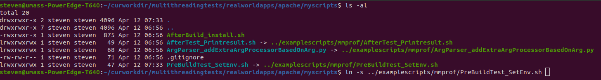
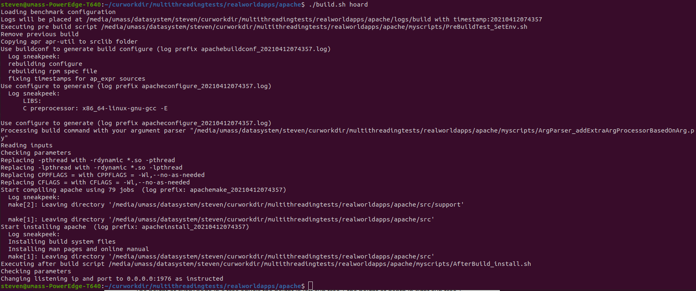
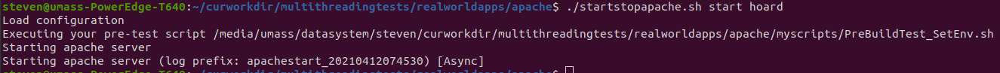

This repository contains multiple test applications for benchmarking and load testing.

## What's new here

This branch intends to create a better benchmarking experience.

Targets:
- Path-independent
  - Clone and run! Works out of the box with minimal config.
- Sufficient comments
- Faster build speed.
- Highly customizable through python scripts/shell scripts.
- Separate built-in and custom scripts, easy upgrade.
- Clear logging.
- Easy upgrade

The philosophy of the new benchmark scripts is "Do one thing and do it well." The core script is only in charge of compiling the libraries correctly. It's designed to be universal, customization is realized by your own scripts.

## How to use

### Clone the repo. Only download modules you want to test

1. Clone this repo into your home folder
    ```
    git clone https://github.com/akopytov/sysbench.git
    ```
    
2. Switch to dev-steven branch
    ```
    git checkout dev-steven
    ```
    
3. Only init git submodules that you want to test
    eg: If you only want to test mysql
    
    ```
    cd ROOT_FOLDER_OF_THIS_REPO
    git submodule update --init --recursive --depth=1 realworldapps/mysql/src
    ```
    eg: If you want to test everything
    ```
    cd ROOT_FOLDER_OF_THIS_REPO
    git submodule update --init --recursive --depth=1
    ```
    
4. Check readme.md. Example scripts


### Check template benchmark and try it.

template benchmark is designed to show how to use and develop this benchmark suite. It consists of an executable linked with a library. And a customized argparsing script will preload a pseudo memory allocator (which is not shipped with the application itself). 

Click [here](/template) to see the template.

### Copy/link example scripts. Customized them.


### Put compiled binary in myartifacts folder for easier reference


### Link your customized scripts in config.sh User Config Zone


### Build



### Test on one build



### Write your scripts to test in bulk

### After you finalized, put your scripts under examplescripts for future reference


## Caution

You should **NOT** change built-in scripts to modify compilation behavior unless you are developing the benchmark suite itself. If you want to make chages to them, you need to make sure they are universal changes that applies to other testing senarios as well. You could easily customize build procedure by editing customized python scripts. (eg: Override compilatioin parameters, Preload a library, Write a log file, Initialize execution envionment .etc)

You should put your own program into the "myscript folder" unless you are developing the benchmark suite itself. After you finish you could move your personalized scripts to examplescripts folder for future reference.