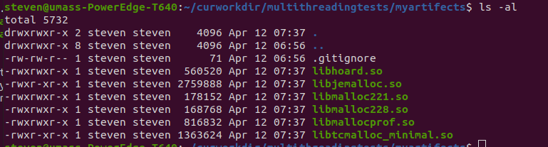
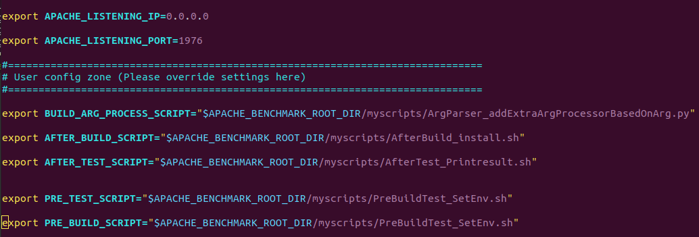
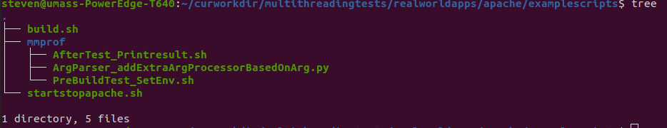

This repository contains multiple test applications for benchmarking and load testing. See the individual folders' README.md files for information on each test.

## What's new here

This branch intends to create a better benchmarking experience.

Targets:
- Path-independent
  - Clone and run! Works out of the box with minimal config.
- Sufficient comments
- Faster build speed.
- Highly customizable through python scripts/shell scripts.
- Separate built-in and custom scripts, easy upgrade.
- Clear logging.
- Easy upgrade

The philosophy of the new benchmark scripts is "Do one thing and do it well." The core script is only in charge of compiling the libraries correctly. It's designed to be universal, customization is realized by your own scripts.

## Overview

```
steven@umass-PowerEdge-T640:~/curworkdir/multithreadingtests$ tree -L 3
.
├── benchmarks  									//Store Parsec
├── config.sh										//Upper level config (Inherit by child)
├── myartifects										//Compiled binaries 
│ 													//(Git ignore)
├── README.md										
├── realworldapps
│   ├── apache
│   │   ├── build.sh -> examplescripts/build.sh    
│   │   ├── config.sh								//Child config, inherit parent
│   │   ├── examplescripts							//Example scripts
│   │   ├── libs
│   │   ├── logs									//Output logs
│   │   ├── myscripts								//Copy examplescripts to here.
│	│	│											//(Git ignore)
│   │   ├── ReadMe.md								//Doc for this test
│   │   ├── requirements.txt						//Library dependency
│   │   ├── src										//Test source code. (Git submodule)
│   │   ├── startstopapache.sh -> examplescripts/startstopapache.sh //Start/stop server
│   │   └── testclient -> ../../realworldappsclient/apache-apr	//Link to client folder
└── realworldappsclient
    ├── apache-apr									
       ├── build.sh -> examplescripts/build.sh
       ├── config.sh
       ├── examplescripts
       ├── libs
       ├── logs
       ├── myscripts
       ├── ReadMe.md
       ├── requirements.txt
       ├── runSingleTest.sh -> examplescripts/runSingleTest.sh
       └── src
```


### Configuration inheritance. Root Path variable in every config [Path-independent]

You should use those root path variables and avoid absolute reference in your scripts.

When you write a benchmark, you need to write a corresponding .md.

### When you are not sure. Open a script and it will explain itself [Sufficient comments]

When you are not sure. Check ReadMe.md. Example scripts. (Which include scripts for our past tools.) And scripts itself. Everything should be well documented.

### Build first, benchmark second. [Faster build speed]

Compilation binaries are stored in separate folder. For each benchmark, you only need to build once. Scripts will leverage multi-core to boost compilation speed.

### Have a new requirement? Customize by yourself without modifying system scripts! [Highly customizable]

We have **PreBuild**, **ArgParser**, **AfterBuild**, **PreTest**, **After Test** hooks available. Use your favorite programming language to build customized scripts. Inputs are fed to you through stdin ,and you print processed version through stdout.

What to process extra arguments? No problem, all arguments passed to general scripts will be passed to your program.

When upgrading, use git pull. Only system scripts (scripts out of my* folder) will be replaced!

### Clear log. [Automatically record/process log]

Scripts will automatically handle log recording and store them in folders by timestamp. You can check any part of the build/test procedure easily. Unnecessary logs won't appear on the screen.

### Seperate system/User scripts. Different projects share one system scripts. [Easy upgrade]

Your scripts and artifacts should reside in my* folder. These folders won't be tracked by git. When there's an upgrade, simply pull from the system script. Since you won't modify any system scripts. The upgrade will work out of the box.

When you finish benchmarking. Create a folder in the examplescript folder and tell other people how your scripts is designed. So they can reuse your scripts later.


## How to use

### Clone the repo. Only download modules you want to test

1. Clone this repo into your home folder
    ```
    git clone https://github.com/akopytov/sysbench.git
    ```
    
2. Switch to dev-steven branch
    ```
    git checkout dev-steven
    ```
    
3. Only init git submodules that you want to test
    eg: If you only want to test mysql
    
    ```
    cd ROOT_FOLDER_OF_THIS_REPO
    git submodule update --init --recursive --depth=1 realworldapps/mysql/src
    ```
    eg: If you want to test everything
    ```
    cd ROOT_FOLDER_OF_THIS_REPO
    git submodule update --init --recursive --depth=1
    ```
    
4. Check readme.md. Example scripts


### Copy/link example scripts. Customized them.


### Put compiled binary in myartifacts folder for easier reference



### Link your customized scripts in config.sh User Config Zone



### Build


### Test on one build


### Write your scripts to test in bulk

### After you finalized, put your scripts under examplescripts for future reference



## Caution

You should **NOT** change built-in scripts to modify compilation behavior unless you are developing the benchmark suite itself. If you want to make chages to them, you need to make sure they are universal changes that applies to other testing senarios as well. You could easily customize build procedure by editing customized python scripts. (eg: Override compilatioin parameters, Preload a library, Write a log file, Initialize execution envionment .etc)

You should **NOT** commit anything that is related to your own program unless you are developing the benchmark suite itself. Changes must be universal to other programs. Check CONTRIBUTION.md for more development guidelines.

